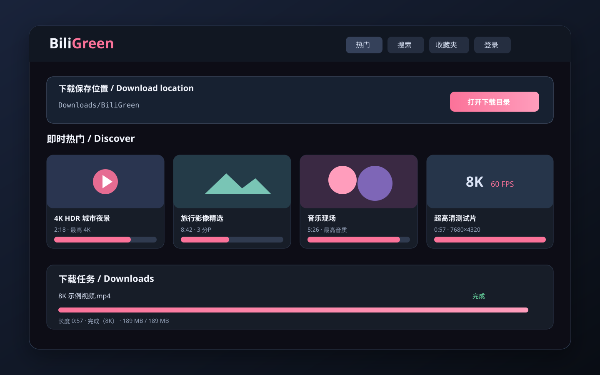

# BiliGreen 0.5.0

English · [简体中文](README.md)



[](https://github.com/Nokia-fan/BiliGreen/releases/latest)
[](https://github.com/Nokia-fan/BiliGreen/actions/workflows/release.yml)
[](LICENSE)

## What is BiliGreen?

BiliGreen is a local Bilibili video and audio downloader distributed as a single-file portable app. End users do not need Go, Python, FFmpeg or a separate media player. Double-clicking the executable opens a web interface accessible only from the local computer.

> Download only content you own, are authorized to save, or the platform explicitly permits. BiliGreen does not bypass membership, payment, DRM, region or account restrictions.

If you only want to use the app, you do not need to read the source or install a development environment. Download the matching archive below, extract it and double-click the executable.

## Download now

| System | Most computers (x64) | ARM64 devices |
| --- | --- | --- |
| Windows | [Windows x64](https://github.com/Nokia-fan/BiliGreen/releases/latest/download/BiliGreen-Windows-amd64.zip) | [Windows ARM64](https://github.com/Nokia-fan/BiliGreen/releases/latest/download/BiliGreen-Windows-arm64.zip) |
| Linux | [Linux x64](https://github.com/Nokia-fan/BiliGreen/releases/latest/download/BiliGreen-Linux-amd64.tar.gz) | [Linux ARM64](https://github.com/Nokia-fan/BiliGreen/releases/latest/download/BiliGreen-Linux-arm64.tar.gz) |

Choose **x64** for most ordinary Windows and Linux computers. See [Releases](https://github.com/Nokia-fan/BiliGreen/releases) for version history and all downloads.

## Highlights

- Portable x64 and ARM64 releases for Windows and Linux.
- QR-code login with an in-memory cookie fallback; account passwords are never accepted.
- Discover feed, Bilibili search, favorites and batch downloads.
- Single- and multi-part videos with part titles and duration metadata.
- Real-time detection of qualities available to the current account, including 4K, 8K, HDR and Dolby Vision when provided by the source.
- Built-in lossless DASH muxing without an FFmpeg dependency.
- Audio-only M4A downloads with detected bitrates and highest quality selected by default.
- Resumable downloads, two concurrent jobs and post-download browser playback.
- Optional remove-or-move actions for successfully downloaded favorites.

## Download location

The default is the `BiliGreen` folder inside the operating system's Downloads directory:

- Windows: `C:\Users\your-name\Downloads\BiliGreen`
- Linux: `/home/your-name/Downloads/BiliGreen`
- macOS: `/Users/your-name/Downloads/BiliGreen`

The path is prominently shown at the top of the app. Enter an absolute path or one beginning with `~`, then select **Apply folder**. The choice is stored only in the current browser. **Open download folder** launches the system file manager.

Videos use `.mp4`; audio-only downloads use `.m4a`. Filenames include the BV ID to avoid collisions. Incomplete downloads use `.part` and can resume when the same item is requested again.

## Quick start

1. Download and extract the archive matching your operating system and CPU.
2. Double-click `BiliGreen.exe` on Windows, or `BiliGreen` on Linux.
3. The app opens `http://127.0.0.1:17890/` automatically.
4. Use QR login for member-only qualities and favorites.
5. Choose a video, part, media type and quality.
6. Use the visible download-location control to find the completed file.
7. Select **Exit app** when finished; closing the browser tab does not stop the service.

Starting the executable again opens the existing instance. Startup failures are written to `BiliGreen-startup-error.txt` beside the executable.

## Privacy and limitations

- The service listens only on `127.0.0.1`.
- Login cookies remain in process memory and are cleared on exit.
- Source videos without audio are saved as silent MP4 files and labeled accordingly.
- Browser playback of HEVC, AV1, Dolby Vision and HDR depends on system codec support.
- DRM, paid-content bypass, region bypass, interactive video and series-specific workflows are not supported.
- The task queue is memory-only. Completed files and `.part` data remain after exit.

See [SECURITY.md](SECURITY.md) for private vulnerability reporting and [CONTRIBUTING.md](CONTRIBUTING.md) for contribution checks.

## Development

Developers need Go 1.22 or newer. End users do not.

```sh
go run .
```

Build binaries and archives with `./build-all.sh` followed by `./package-release.sh`. Raw binaries are written to `build/`; release archives to `release/`.

## Creation and acknowledgements

BiliGreen was initiated and is maintained by [Nokia-fan](https://github.com/Nokia-fan), with assistance from [OpenAI Codex](https://openai.com/codex/) in product design, implementation, debugging, testing, documentation and release preparation.

Codex is credited as an AI collaboration tool rather than an independent GitHub account or repository member. The maintainer remains responsible for the project's direction, final decisions, published content and ongoing maintenance. See [CONTRIBUTORS.md](CONTRIBUTORS.md) for details.
